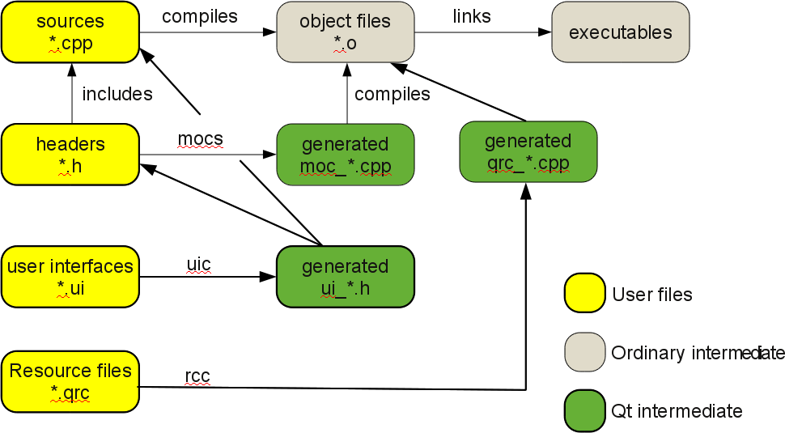
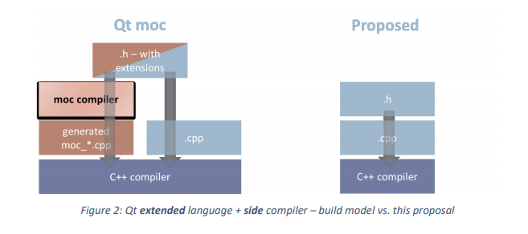
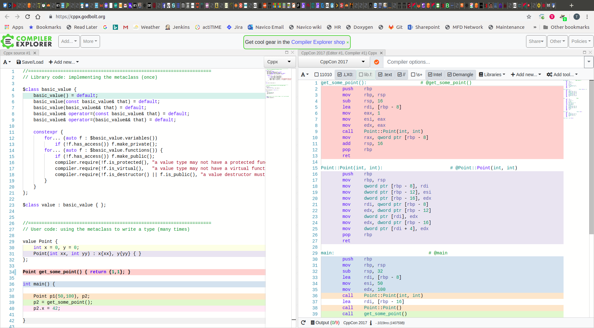

<!-- $theme: default -->

Reflection in Qt and Beyond
===


##### [Auckland C++ Meetup](https://www.meetup.com/Auckland-C-Meetup/)

###### Presented by Tom Isaacson ( [@parsley72](https://twitter.com/parsley72) )
https://github.com/tomisaacson/reflection-in-Qt

---
<!-- page_number: true -->

# Qt Introduction

* Used for developing graphical user interfaces (GUIs) and multi-platform applications.
* Non-GUI programs can be also developed, such as command-line tools and consoles for servers.
* Runs on all major desktop platforms and most mobile or embedded platforms.
* Supports various compilers, including the GCC C++ compiler and the Visual Studio suite and has extensive internationalization support.
* Qt also provides Qt Quick, that includes a declarative scripting language called QML that allows using JavaScript to provide the logic.
* Other features include SQL database access, XML parsing, JSON parsing, thread management and network support.

---


---

# Qt Rough Guide

The `QObject` class is the base class of all Qt objects.

`QObject` is the heart of the Qt Object Model. The central feature in this model is a very powerful mechanism for seamless object communication called `signals` and `slots`. You can connect a signal to a slot with `connect()` and destroy the connection with `disconnect()`.

`QObject`s organize themselves in object trees. When you create a `QObject` with another object as parent, the object will automatically add itself to the parent's `children()` list. The parent takes ownership of the object; i.e. it will automatically delete its children in its destructor. You can look for an object by name and optionally type using `findChild()` or `findChildren()`.

---

# [Using the Meta-Object Compiler (moc)](https://doc.qt.io/qt-5.11/moc.html)

The Meta-Object Compiler, moc, is the program that handles Qt's C++ extensions.

The moc tool reads a C++ header file. If it finds one or more class declarations that contain the `Q_OBJECT` macro, it produces a C++ source file containing the meta-object code for those classes. Among other things, meta-object code is required for the signals and slots mechanism, the run-time type information, and the dynamic property system.

The C++ source file generated by moc must be compiled and linked with the implementation of the class.

If you use qmake to create your makefiles, build rules will be included that call the moc when required, so you will not need to use the moc directly.

---



---

## Legacy code

```cpp
class tColoredObject : public QObject
{
    Q_OBJECT

public:
    enum eColor
    {
        ColorRed = 1,
        ColorBlue = 2,
        ColorGreen = 3
    };

    tColoredObject() : m_color(ColorRed) {}

private:
    eColor m_color;
};

Q_DECLARE_METATYPE(tColoredObject::eColor);

int main()
{
    qRegisterMetaType(tColoredObject::eColor); // required to use the enum in signals/slots
    ...
}

void HandleColor(tColoredObject::eColor color)
{
    switch (color)
    {
        case ColorRed: qDebug("Red"); break;
        case ColorBlue: qDebug("Blue"); break;
        case ColorGreen: qDebug("Green"); break;
        default: assert(0);
    }
}

```

---

# Enum Class

We can replace `enum` with `enum class` which improves the type safety. If we turn on [C4062](https://docs.microsoft.com/en-us/cpp/error-messages/compiler-warnings/compiler-warning-level-4-c4062) in Visual Studio (which is on by default in GCC) we get a warning if an enum class enumerator isn't handled in a switch statement. This is useful to spot where new enumerators need to be handled so we can change the code.

---

```cpp
class tColoredObject : public QObject
{
    Q_OBJECT

public:
    enum class eColor
    {
        Red = 1,
        Blue = 2,
        Green = 3
    };

    tColoredObject() : m_color(tColoredObject::eColor::Red) {}

private:
    eColor m_color;
};

Q_DECLARE_METATYPE(tColoredObject::eColor);

int main()
{
    qRegisterMetaType(tColoredObject::eColor);
    ...
}

void HandleColor(tColoredObject::eColor color)
{
    switch (color)
    {
        case tColoredObject::eColor::Red: qDebug("Red"); break;
        case tColoredObject::eColor::Blue: qDebug("Blue"); break;
        case tColoredObject::eColor::Green: qDebug("Green"); break;
    }
}
```

But this means the assert we get if the enum class is an undefined value has gone so it's not an exact replacement.

---

## Enum class can still be an unspecified value

```cpp
    tColoredObject::eColor color = 5; // error: cannot convert 'int' to 'tColoredObject::eColor' in initialization
    color = static_cast<tColoredObject::eColor>(5); // ok
```

[expr.static.cast]/10:

> A value of integral or enumeration type can be explicitly converted to a complete enumeration type. The value is unchanged if the original value is within the range of the enumeration values (7.2). Otherwise, the behavior is undefined.

---

```cpp
#include <boost/static_assert.hpp>

//-----------------------------------------------------------------------------
//! Base template function definition for the Minimum range of an enum of type T.
//! It is expected that the enum shall provide a total template specialization
//! for the enum of type T, so this function should not be called.
//-----------------------------------------------------------------------------
template <typename T>
T EnumRangeMin()
{
    BOOST_STATIC_ASSERT_MSG(sizeof(T) == 0, "EnumRangeMin - No template specialization for the EnumRangeMin function for the given enum");

    // If you receive this compile time message it means you need to supply a template specialization
    // for the enum type for which you tried to call 'ConvertIntToEnumLinearRange' e.g.:
    // template<> eMyEnum EnumRangeMin<eMyEnum>() {return eMinValueForMyEnum;}

    return static_cast<T>(0);
}

//-----------------------------------------------------------------------------
//! Base template function definition the Maximum range of the enum of type T.
//! It is expected that the enum shall provide a total template specialization
//! for the enum of type T, so this function should not be called.
//-----------------------------------------------------------------------------
template <typename T>
T EnumRangeMax()
{
    BOOST_STATIC_ASSERT_MSG(sizeof(T) == 0, "EnumRangeMax - No template specialization for the EnumRangeMax function for the given enum");

    // If you receive this compile time message it means you need to supply a template specialization
    // for the enum type for which you tried to call 'ConvertIntToEnumLinearRange' e.g.:
    // template<> eMyEnum EnumRangeMax<eMyEnum>() {return eMaxValueForMyEnum;}
    return static_cast<T>(0);
}
```

---

```cpp
//-----------------------------------------------------------------------------
//! Function to convert a value (of unspecified type) to an enum. The value to be converted
//! must lie within an enum linear range where:
//! EnumRangeMin<T>() <= \a val <= EnumRangeMax<T>()
//! If the value that is supplied does not lie within the range the result is either
//! the minimum (when too small) or maximum (when too large) range value of the enum.
//-----------------------------------------------------------------------------
template <typename T, typename V>
T ConvertValueToEnumLinearRange(V val)
{
    // If the value is outside the linear range then, we constrain the result to either min or max
    T minRange = EnumRangeMin<T>();
    if (val < static_cast<V>(minRange))
        return minRange;

    T maxRange = EnumRangeMax<T>();
    if (val > static_cast<V>(maxRange))
        return maxRange;

    // The value exists within the range, so provide the converted the value
    return static_cast<T>(val);
}
```

---

We can use this to recreate the assert we removed from the switch:
<https://godbolt.org/z/QwJqSO>

```cpp
template <>
tColoredObject::eColor EnumRangeMin<tColoredObject::eColor>()
{
    return tColoredObject::eColor::Red;
}
template <>
tColoredObject::eColor EnumRangeMax<tColoredObject::eColor>()
{
    return tColoredObject::eColor::Green;
}

void HandleColor(tColoredObject::eColor color)
{
    switch (color)
    {
        case tColoredObject::eColor::Red: printf("Red"); break;
        case tColoredObject::eColor::Blue: printf("Blue"); break;
        case tColoredObject::eColor::Green: printf("Green"); break;
    }
    assert(color == ConvertValueToEnumLinearRange<tColoredObject::eColor>(color));
}
```

---

# Q_ENUM

I was looking into this and I found [New in Qt 5.5: Q_ENUM and the C++ tricks behind it](https://woboq.com/blog/q_enum.html). This explains the new [Q_ENUM()](https://doc.qt.io/qt-5/qobject.html#Q_ENUM).

---

```cpp
class tColoredObject : public QObject
{
    Q_OBJECT

public:
    enum class eColor
    {
        Red = 1,
        Blue = 2,
        Green = 3
    };
    Q_ENUM(eColor)

    tColoredObject() : m_color(tColoredObject::eColor::Red) {}

private:
    eColor m_color;
};
```

---

This is great, but it also means you can use Qt's reflection. I've added `AssertIfValueIsOutsideQEnumRange()` which asserts if the enum class value is undefined:

```cpp
template <typename T, typename V>
void AssertIfValueIsOutsideQEnumRange(V val)
{
    const QMetaEnum metaEnum = QMetaEnum::fromType<T>();
    const int nVal = static_cast<int>(val);
    const char* keyStr = metaEnum.valueToKey(nVal);
    if (keyStr == nullptr)
    {
        const QString output =
            QString("AssertIfValueIsOutsideQEnumRange(%1): outside range of %2::%3").arg(nVal).arg(metaEnum.scope()).arg(metaEnum.name());
        qDebug(output);
    }
    assert(keyStr != nullptr);
}
```

---

This replaces the assert:

```cpp
void HandleColor(tColoredObject::eColor color)
{
    switch (color)
    {
        case tColoredObject::eColor::Red: qDebug("Red"); break;
        case tColoredObject::eColor::Blue: qDebug("Blue"); break;
        case tColoredObject::eColor::Green: qDebug("Green"); break;
    }
    AssertIfValueIsOutsideQEnumRange<tColoredObject::eColor>(color);
}
```

---

## `QString` from `enum class`

```cpp
//-----------------------------------------------------------------------------
//! Function to convert an enum value to a QString. The enum must be declared as Q_ENUM.
//-----------------------------------------------------------------------------
template <typename T, typename V>
QString ConvertQEnumValueToString(V val)
{
    const QMetaEnum metaEnum = QMetaEnum::fromType<T>();
    const char* str = metaEnum.valueToKey(static_cast<int>(val));
    return QString::fromUtf8(str);
}
```

---

## `Q_NAMESPACE`

`Q_ENUM` can only be used within a `QObject` class.

[New in Qt 5.8: meta-object support for namespaces](https://www.kdab.com/new-qt-5-8-meta-object-support-namespaces/)

```cpp
namespace MyNamespace
{
    Q_NAMESPACE

    enum class SomeEnum {
        Foo,
        Bar
    };
    Q_ENUM_NS(SomeEnum)
}
```

---

> From: Tom Isaacson <tom.isaacson@Navico.com>  
> Sent: Wednesday, December 19, 2018 10:09 PM  
> To: interest@qt-project.org  
> Subject: Use QMetaEnum::keyCount() to initialise array
>
> Is it possible to use QMetaEnum::keyCount() to initialise an array? Something like:
>
```cpp
    const QMetaEnum metaEnum = QMetaEnum::fromType<MyArray>();
    int MyArray[metaEnum.keyCount()];
```
>
> It seems like Q_ENUM declares functions with Q_DECL_CONSTEXPR in C++11 but I can't figure out how to get this to work.

---

> From: Konstantin Shegunov <kshegunov@gmail.com>  
> Sent: Wednesday, December 19, 2018 10:37 PM
>
> Compiles for me (with g++ 8.2, -std=gnu++11 which is expanded from CONFIG += c++11).

> From: Nikos Chantziaras <realnc@gmail.com>  
> Sent: Thursday, December 20, 2018 6:22 AM
>
> Unfortunately, that's a variable length array, which is a GNU extension.

---

> From: Nikos Chantziaras <realnc@gmail.com>  
> Sent: Thursday, December 20, 2018 6:29 AM
>
> Are you sure they're constexpr? From what I can see in Qt 5.12, keyCount() is not constexpr. It's just const.

> From: Tom Isaacson <tom.isaacson@navico.com>  
> Sent: Monday, December 31, 2018 8:29 AM
>
> You're right, keyCount() isn't. My confusion is that Q_ENUM declares its functions as constexpr:
>
```cpp
    #define Q_ENUM(ENUM) \
        friend Q_DECL_CONSTEXPR const QMetaObject *qt_getEnumMetaObject(ENUM) Q_DECL_NOEXCEPT { return &staticMetaObject; } \
        friend Q_DECL_CONSTEXPR const char *qt_getEnumName(ENUM) Q_DECL_NOEXCEPT { return #ENUM; }
```
>
> But I don't understand why if the functions that then use them aren't.

---

> From: Tom Isaacson <tom.isaacson@navico.com>  
> Sent: Monday, December 31, 2018 8:43 AM  
> To: development@qt-project.org  
> Subject: Use QMetaEnum::keyCount() to initialise array
>
> Is it possible to use QMetaEnum::keyCount() to initialise an array? Something like:
>
```cpp
    const QMetaEnum metaEnum = QMetaEnum::fromType<MyArray>();
    int MyArray[metaEnum.keyCount()];
```
>
> After asking this on the Qt-Interest forum I spent a bit of time investigating. Q_ENUM declares functions with Q_DECL_CONSTEXPR:
>
```cpp
    #define Q_ENUM(ENUM) \
        friend Q_DECL_CONSTEXPR const QMetaObject *qt_getEnumMetaObject(ENUM) Q_DECL_NOEXCEPT { return &staticMetaObject; } \
        friend Q_DECL_CONSTEXPR const char *qt_getEnumName(ENUM) Q_DECL_NOEXCEPT { return #ENUM; }
```

---

> In my example code above, QMetaEnum::fromType() calls these functions:
>
```cpp
    template<typename T> static QMetaEnum fromType() {
        Q_STATIC_ASSERT_X(QtPrivate::IsQEnumHelper<T>::Value,
                          "QMetaEnum::fromType only works with enums declared as Q_ENUM or Q_FLAG");
        const QMetaObject *metaObject = qt_getEnumMetaObject(T());
        const char *name = qt_getEnumName(T());
        return metaObject->enumerator(metaObject->indexOfEnumerator(name));
    }
```
>
> Where it breaks is the last line, because [QMetaObject::indexOfEnumerator()](https://github.com/qt/qtbase/blob/96efc38f100686a8183f45367e54bf6cb670bdba/src/corelib/kernel/qmetaobject.cpp#L968) uses d.data:
>
```cpp
    int QMetaObject::indexOfEnumerator(const char *name) const
    {
        const QMetaObject *m = this;
        while (m) {
            const QMetaObjectPrivate *d = priv(m->d.data);
```

---

> Which is only [defined as const](https://github.com/qt/qtbase/blob/96efc38f100686a8183f45367e54bf6cb670bdba/src/corelib/kernel/qobjectdefs.h#L578):
>
```cpp
    struct { // private data
        const QMetaObject *superdata;
        const QByteArrayData *stringdata;
        const uint *data;
```
>
> I don't know how the Meta-Object Compiler creates this but surely it's possible to change it to be constexpr?

---

> From: Thiago Macieira <thiago.macieira@intel.com>  
> Sent: Tuesday, January 1, 2019 12:52 AM
>
> No, it's not.

---

> From: Thiago Macieira <thiago.macieira@intel.com>  
> Sent: Thursday, January 3, 2019 12:45 AM
>
> Because the information is not known to the compiler at compile time. You need moc's parsing of the header in order for it to count how many enumerators are there in the enumeration. Like you said, if we had static reflections, we could do this entirely in the compiler -- we would do possibly ALL of moc as part of reflections.
>
> But until that happens, moc needs to run and will produce a .cpp with the count.

---

> If you did have access to moc's output, you could access the enumeration count in constexpr time. After all, QMetaEnum::keyCount is simply:
>
```cpp
    const int offset = priv(mobj->d.data)->revision >= 8 ? 3 : 2;
    return mobj->d.data[handle + offset];
```
>
> Note that moc produces those arrays as "static const", not "constexpr", so it may not be accessible *today* at constexpr evaluation time. Or it could. I don't remember if "static const" counts as constant expression...
>
> The problem is that you have to #include the moc's output in the TU that wants to create the OP's array. And it must be #include'd or built by the build system exactly *once*.

---

> From: Thiago Macieira <thiago.macieira@intel.com>  
> Sent: Thursday, January 3, 2019 1:43 AM
>
> To be stricter: it *is* know to the compiler, but without a constexpr reflection API, we can't get the information out of the compiler and into code.

---

> From: Tom Isaacson <tom.isaacson@navico.com>  
> Sent: Tuesday, January 8, 2019 7:51 AM
>
> I wonder if moc-ng could handle this?
>
> Proof Of Concept: Re-implementing Qt moc using libclang:
> <https://woboq.com/blog/moc-with-clang.html>

---

> From: Olivier Goffart <olivier@woboq.com>  
> Sent: Tuesday, January 8, 2019 8:21 PM
>
> Not really, even if it can generate things in a header for templates, it still generates the actual data in a .cpp file.
As it was said before, we can't really have the contents of the QMetaObject.
Even verdigris does the same (putting the QMetaObject data in the .cpp)
>
> One would have to do more research to find out if it is possible. Maybe putting more data in the QMetaEnum directly. Not sure if this is possible in a binary compatible way.
<https://github.com/woboq/verdigris>

---

# C++ Standards

Herb Sutter's [Trip report: Winter ISO C++ standards meeting (Kona)](https://herbsutter.com/2019/02/23/trip-report-winter-iso-c-standards-meeting-kona/)
> **Reflection TS v1 (David Sankel, Axel Naumann) completed.**
> The Reflection TS international comments have now been processed and the TS is approved for publication. As I mentioned in other trip reports, note again that the TS’s current template metaprogramming-based syntax is just a placeholder; the feedback being requested is on the core “guts” of the design, and the committee already knows it intends to replace the surface syntax with a simpler programming model that uses ordinary compile-time code and not <>-style metaprogramming.

---

## [N4746](https://wg21.link/n4746): Working Draft, C++ Extensions for Reflection

---

## C++Now 2019

"The C++ Reflection TS"  
David Sankel  
Wednesday, May 8: 09:00 - 10:30

What is the C++ Reflection TS and what will it do for me? The answer: a lot. This talk explains this exciting new language feature, demonstrates how it is used, and discusses the direction reflection is taking within the C++ standardization committee. 

David Sankel is a co-author of the Reflection TS and currently serves as its project editor.

---

## CppCon 2018

“Compile-time programming and reflection in C++20 and beyond”  
Louis Dionne  
<https://www.youtube.com/watch?v=CRDNPwXDVp0>

---

# Plan

1. Make (almost) all of C++ available in `constexpr`.
2. Provide a `constexpr` API to query the compiler.
3. Provide a means for modifying the AST (Abstract Syntax Tree).

---

* The Reflection TS: [wg21.link/n4746](https://wg21.link/n4746)
* Standard containers and `constexpr`: [wg21.link/p0784](https://wg21.link/p0784)
* Making `std::vector` `constexpr`: [wg21.link/p1004](https://wg21.link/p1004)
* Making `<algorithm>` `constexpr`: [wg21.link/p0202](https://wg21.link/p0202) et al
* `std::is_constant_evaluated()`: [wg21.link/p0595](https://wg21.link/p0595)
* `constexpr!` functions: [wg21.link/p1073](https://wg21.link/p1073)
* Metaclasses: [wg21.link/p0707](https://wg21.link/p0707)
* Value-based reflection: [wg21.link/p0993](https://wg21.link/p0993)
* Calling virtual functions in `constexpr`: [wg21.link/p1064](https://wg21.link/p1064)
* `try-catch` in `constexpr`: [wg21.link/p1002](https://wg21.link/p1002)

---

# Step 1: Expanding `constexpr`

Necessary in order to use non-trivial data structures and execute non-trivial logic at compile time.

---

## In C++11 `constexpr` was very limited:

```cpp
constexpr std::size_t count_lower(char const* s, std::size_t count = 0)
{
    return *s == '\0' ? count
                    : 'a' <= *s && *s <= 'z'
                        ? count_lower(s + 1, count + 1)
                        : count_lower(s + 1, count);
}

static_assert(count_lower("aBCdeF") == 3), "");
```

---

## In C++14 many restrictions lifted:

```cpp
constexpr std::size_t count_lower(char const* s)
{
    std::size_t count = 0;
    for (; *s != '\0'; ++s)
    {
        if ('a' <= *s && *s <= 'z')
        {
            ++count;
        }
    }
    return count;
}

static_assert(count_lower("aBCdeF") == 3), "");
```

---

## In C++17, `constexpr` is still limited:

* No allocations.
* No try-catch.
* No virtual calls.
* No `reinterpret_cast`.

---

## This means we can't use variable-size containers:

```cpp
template <typename Predicate>
constexpr std::vector<int>
keep_if(int const* it, int const* last, Predicate pred)
{
    std::vector<int> result;
    for (; it != last; ++it)
    {
        if (pred(*it))
        {
            result.push_back(*it);
        }
    }
    return result;
}

constexpr int ints[] = {1, 2, 3, 4, 5, 6};
constexpr std::vector<int> odds = keep_if(std::begin(ints), std::end(ints), is_odd);
// doesn't work!
```

---

## We have to use fixed-size arrays, which is painful:

```cpp
template <srd::size_t K, typename Predicate>
constexpr std::vector<int, K>
keep_if(int const* it, int const* last, Predicate pred)
{
    std::vector<int, K> result;
    int* out = std::begin(result);
    for (; it != last; ++it)
    {
        if (pred(*it))
        {
            *out = *it;
        }
    }
    return result;
}

constexpr int ints[] = {1, 2, 3, 4, 5, 6};
constexpr std::vector<int, 3> odds =
    keep_if<3>(std::begin(ints), std::end(ints), is_odd);
```

---

## Enter [P0784](https://wg21.link/p0784) : More `constexpr` containers

* Enables *new-expressions* in `constexpr`.
* Makes `std::allocator` usable in `constexpr`.
* Promotes some `constexpr` objects to static storage.

---

The following becomes valid:

```cpp
constexpr int* square(int* first, int* last)
{
    std::size_t N = last - first;
    int* result = new int[N]; // <== HERE
    for (std::size_t i = 0; i != N; ++i, ++first)
    {
        result[i] = *first * *first;
    }
    return result;
}

constexpr void hello()
{
    int ints[] = {1, 2, 3, 4, 5};
    int* squared = square(std::begin(ints), std::end(ints));
    delete[] squared;
}
```

---

## Obvious next step

Make `std::vector` `constexpr`.

## But `std::vector` uses try-catch

So make try-catch `constexpr`!

---

## Enter [P1002](https://wg21.link/p1002): Try-catch blocks in `constexpr` functions

```cpp
template <std::size_t N>
constexpr std::array<int, N>
square(std::array<int, N> array, int from, int to)
{
    try {
        for (; from != to; ++from)
        {
            array.at(from) = array.at(from) * array.at(from);
        }
    } catch (std::out_of_range const& e) {
        // ...
    }
    return array;
}

// Works because we never execute a throw statement
constexpr auto OK     = square(std::array{1, 2, 3, 4}, 0, 4);
// Fails
constexpr auto NOT_OK = square(std::array{1, 2, 3, 4}, 0, 10);
```

---

## Fails when we execute the `throw` inside `array::at`:

```cpp
template <class T, std::size_t Size>
constexpr typename array<T, Size>::reference
array<T, Size>::at(std::size_t n)
{
    if (n >= Size)
        throw std::out_of_range("array::at"); // compilation error here

    return elements_[n];
}
```

So for now try-catch blocks are allowed but they're basically no-ops because throws aren't allowed. If you hit a `throw` at compile-time you just get a compiler error.

---

## Back to `std::vector`

In C++20, this will just work:

```cpp
template <typename Predicate>
constexpr std::vector<int>
keep_if(int const* it, int const* last, Predicate pred)
{
    std::vector<int> result;
    for (; it != last; ++it)
    {
        if (pred(*it))
        {
            result.push_back(*it);
        }
    }
    return result;
}

constexpr int ints[] = {1, 2, 3, 4, 5, 6};
constexpr std::vector<int> odds =
    keep_if(std::begin(ints), std::end(ints), is_odd);
```

---

## Future `constexpr` additions

* `std::string`
* `std::map` and `std::unordered_map`
* `std::optional/std::variant`?
* Math functions?

---

## Challenges

* `reinterpret_cast`, e.g. `std::string` Small Buffer Optimisation (SBO).
* non-`constexpr` builtins, e.g. `__builtin_memcpy`.
* Raw memory allocation, e.g. `malloc`.
* Other annotations, e.g. Undefined Behaviour Sanitizer (UBSan) in libc++.

---

## Enter [P0595](https://wg21.link/p0595): `std::is_constant_evaluated()`

* Allows detecting whether the current function is evaluated as part of a constant expression.

---

## For example

```cpp
template <typename T>
void vector<T>::clear() noexcept {
    size_t old_size = size();
    // destroy [begin(), end()]
    __annotate_shrink(old_size); // Address Sanitizer (ASan) annotation
    __invalidate_all_iterators(); // Debug mode checks
}
```

---

## Making this `constexpr`

```cpp
template <typename T>
constexpr void vector<T>::clear() noexcept {
    size_t old_size = size();
    // destroy [begin(), end()]
    if (!std::is_constant_evaluated()) {
        __annotate_shrink(old_size); // Address Sanitizer (ASan) annotation
        __invalidate_all_iterators(); // Debug mode checks
    }
}
```

---

## How this works

```cpp
constexpr int f() {
    std::vector<int> v = {1, 2, 3};
    v.clear();
    return 0;
}

// is_constant_evaluated() true, no annotations
constexpr int X = f();

// is_constant_evaluated() false, normal runtime code
int Y = f();
```

---

## Another common problem

`constexpr` does not require compile-time evaluation.

Enter `constexpr!` ([P1073](https://wg21.link/p1073): Immediate function)

```cpp
constexpr! int square(int x)
{
    return x * x;
}

constexpr int x = square(3); // OK

int y = 3;
int z = square(y); // ERROR: square(y) is not a constant expression
```

Functions don't exist at runtime.

---

## Summary of `constexpr` changes

* Expand `constexpr` to support more use cases.
* Allow persisting data structures to the *data segment*.
* Allow writing different code for `constexpr` and runtime when needed.
* Require compile-time evaluation with `constexpr!`

---

# Step 2: An API to speak to the compiler

We can already do some of it:
* type_traits, operators like `sizeof`

```cpp
struct Foo
{
    int x;
    int y;
};

constexpr std::size_t = sizeof(Foo);
constexpr bool is_aggregate = std::is_aggregate_v(Foo);
```

---

## But we're severely limited

Currently, limited to queries whose answer is a primitive type.

```cpp
struct Foo
{
    int x;
    int y;
};

constexpr auto members = ???; // List of Foo's members
```

---

## Enter the Reflection Technical Specification (TS): [N4746](https://wg21.link/n4746)

Purpose:

* Figure out what this query API should look like.
* Not the specific implementation of this API.
* For now, the API uses template metaprogramming.

---

## Example: Extracting members

```cpp
struct Foo
{
    int x;
    long y;
}

using MetaFoo = reflexpr(Foo); // Returns magic type
using Members = std::reflect::get_data_members_t<MetaFoo>; // Another magic type

using MetaX = std::reflect::get_element_t<0, Members>; // Not an int!
constexpr bool is_public = std::reflect::is_public_v<MetaX>;

using X = std::reflect::get_reflected_type_t<Metax>; // This is int!
```

---

## Another example: Printing an `enum`

```cpp
enum class Color { RED, GREEN, BLUE, YELLOW, PURPLE };

std::ostream& operator<<(std::ostream& out, Color color)
{
    using Enumerators = std::reflect::get_enumerators_t<reflexpr(Color)>;
    auto helper = [&]<std::size_t ...i>(std::index_sequence<i...>)
    {
        ([&] {
            using Enumerator = std::reflect::get_element_t<i, Enumerators>;
            if (color == std::reflect::get_constant_v<Enumerator>)
            {
                out << std::reflect::get_name_v(Enumerator);
            }
        }(), ...);
    };

    constexpr std::size_t N = std::reflect::get_size_v<Enumerators>;
    helper(std::make_index_sequence<N>{});
    return out;
}
```

---

## Other features

* Get source line/column of a type definition.
* Get the name of an entity as a string.
* Get member types/enums/etc of a type.
* Get base classes of a type.
* Get whether variable is `static`/`constexpr`.
* Get properties of base classes: `virtual`/`public`/etc

More features planned in the future:
* Reflecting functions: [P0670](https://wg21.link/p0670)
* Plans to reflect on arbitrary expressions too.

---

## Final syntax is not settled yet: [P0953](https://wg21.link/p0953)

Plan to rebase on top of `constexpr` notation.

```cpp
struct Foo
{
    int x;
    long y;
}

constexpr std::reflect::Record meta_foo = reflexpr(Foo);
constexpr std::vector members = meta_foo.get_data_members();

constexpr std::reflect::RecordMember meta_x = members[0];
constexpr bool is_public = meta_x.is_public();
constexpr std::reflect::Type x = meta_x.get_reflected_type();

using X = unreflexpr(x); // This is int!
```

Need `unreflexpr` to translate from metadata back to type system.

---

## Another example: Print an enum

```cpp
enum class Color { RED, GREEN, BLUE, YELLOW, PURPLE };

std::ostream& operator<<(std::ostream& out, Color color)
{
    constexpr std::vector enumerators = reflexpr(Color).get_enumerators();
    for... (constexpr std::reflect:Enumerator enumerator : enumerators)
    {
        if (color == enumerator.get_constant())
        {
            out << enumerator.get_name();
        }
    }
    return out;
}
```

---

## `for...`? [P0589](https://wg21.link/p0589)

Not a normal `for` loop. Expands roughly to:
```cpp
std::ostream& operator<<(std::ostream& out, Color color)
{
    constexpr std::vector enumerators = reflexpr(Color.get_enumerators();
    {
        constexpr std::reflect::Enumerator enumerator = enumerators[0];
        if (color == enumerator.get_constant()) {
            out << enumerator.get_name();
        }
    }
    {
        constexpr std::reflect::Enumerator enumerator = enumerators[1];
        if (color == enumerator.get_constant()) {
            out << enumerator.get_name();
        }
    }
    // ...
    return out;
}
```
so you can have a different type at each step of the `for...` loop.

---

## Status of reflection

1. Reflection TS figures out the compiler query API.
2. Will rebase on top of the `constexpr` work.
3. Aim is to write normal-looking C++ code.

---

# Step 3: Code Injection

Alternatives considered in [P0633](https://wg21.link/p0633):

1. ~~Raw string injection.~~
2. ~~Programmatic API.~~
3. Token-sequence injection.

Go to Herb's keynote:  
"Thoughts on a more powerful and simpler C++ (5 of N)"  
<https://www.youtube.com/watch?v=80BZxujhY38>

(First half is on CPPX, second on Metaclasses.)

---

## Associate data with locks, take 1 (good)

Observation: If we knew which mutex covered which data, we could diagnose "oops, forgot to lock" and "oops, took the wrong lock".

A manual discipline to group data with its mutex:

```cpp
struct MyData {
    vector<int>& v()        { assert(m_.is_held() ); return v_; }
    Widget*&     w()        { assert(m_.is_held() ); return w_; }
    void         lock()     { m_.lock(); }
    bool         try_lock() { return m_.try_lock(); }
    void         unlock()   { m_.unlock(); }

private:
    vector<int> v_;
    Widget*     w_;
    mutex_type  m_;
}
```

* Resonable migration from existing source (perhaps just add "()").
* Repetitive: It would be nice to automate the boring parts...

---

## Step 1: A testable mutex

Many mutex types (including `std::mutex`) don't provide a way to ask "have I acquired this?". A simple wrapper to the rescue:

```cpp
template<typename Mutex>
class TestableMutex {
public:
    void lock()     { m.lock(); id = this_thread::get_id(); }
    void unlock()   { id = thread::id(); m.unlock(); }
    bool try_lock() {
        bool b = m.try_lock();
        if (b)
            id = this_thread::get_id();
        return b;
    }
    bool is_held()  { return id == this_thread::get_id(); }
private:
    Mutex m;
    atomic<thread::id> id;
} // for recursive mutexes, can also add a count.
```

---

## Step 2: Innocence by association

Boilerplate (sorry for the macros):

```cpp
#define GUARDED_WITH(MutType) \
    public: void lock()     { mut_.lock(); } \
    public: bool try_lock() { mut_.try_lock(); } \
    public: void unlock()   { mut_.unlock(); } \
    private: TestableMutex<MutType> mut_;

// Have to use token pasting to make a different member name for the private member than for the accessor.
// Otherwise the user would have to specify two names - one for the the public name and the other for the private name.
#define GUARDED_WITH(Type,name) \
    public: Type& name() { assert(mut_.is_held()); return name##_; } \
    private: Type name##_;
```

Then we associate data with a mutex more easily:

```cpp
// Have to refer to the macro that was declared earlier 
struct MyData {
    GUARDED_WITH(mutex_type);
    GUARDED_MEMBER(vector<int>, v);
    GUARDED_MEMBER(Widget*, w);
}
```

---

## Error detection, the sooner, the better

Now we can find many latency race conditions automatically and deterministically at test time (vast improvement over intermittent timing-dependent customer bugs).

```cpp
MyData data1 = ..., data2 = ...;
vector<int>* sneaky = nullptr;

data1.v().push_back(10); // error: will assert
data2.w()->ProcessYearEnd(); // error: will assert
{ // enter critical section
    lock_guard<MyData> hold(data1); // can treat it as a lockable object
    data1.v().push_back(10); // ok, locked
    data2.w()->ProcessYearEnd(); // error: will assert
    sneaky = &data1.v(); // ok, but avoid doing this
}
sneaky->push_back(10); // error, but won't assert
```

Catches both "oops, forgot to lock" and "oops, took the wrong lock".

---

## Using a `guarded<M>` metaclass

[P0707](http://wg21.link/p0707) R4

```cpp
// Today a metaclass is defined as template<type T> (T source)
// Additional template parameter M which is the mutex type
template<typename M, typename T>
constexpr void guarded(T source) {
    guarded_with<M>; // generates lock(), try_lock(), unlock() and the mutex of type M.

    // for every member variable
    for... (auto o : source.member_variables()) {
        // create an accessor and a private variable with a suffix name
        guarded_member(o.type(), o.name());
    }

    // Checks at compile time that you're not guarding a class with no data members.
    compiler.require(source.member_functions().siz
        "a guarded class may not have member funct"
        "release (in the next release, we may supp"
        "synchronised functions)");
};

// User code: using a metaclass to write a type
class(guarded<mutex_type>) MyData
{
    vector<int> v;
    Widget* w;
};
```

---

## [P0707](http://wg21.link/p0707) R3: Metaclasses: Generative C++

4. Applying metaclasses: Qt moc and C++/WinRT



---

## 4.1 Qt moc -> metaclasses (sketch)

This section sketches an approach for how Qt moc could be implemented in terms of metaclass functions.

The approach centers on writing metaclasses to encapsulate Qt conventions. In particular:
| Feature | Qt moc style | Proposed |
| ------- | ------------ | -------- |
| Qt class | `: public QObject` | `QClass metaclass` |
| | `Q_OBJECT` macro | |
| Signals and slots | `signals:` access specifier | `qt::signal` type |
| | `slots:` access specifier | `qt::slot` type |
| | Both are grammar extensions | No grammar extensions |
| Properties | `Q_PROPERTY` macro | `property<>` metaclass (note: not necessarily specific to Qt) |
| Metadata | Generated by moc compiler | Generated in `QClass` metaclass code, or separately by reflection |

---

Consider this example, which uses a simple property for which it’s easy to provide a default (as do C# and other
languages), and a simple signal (outbound event notification) and slot (inbound event notification):

**Qt moc style:**

```cpp
class MyClass : public QObject {
    Q_OBJECT
public:
    MyClass(QObject* parent = nullptr);
    Q_PROPERTY(int value READ get_value WRITE set_value)
    int get_value() const { return value; }
    void set_value(int v) { value = v; }
private:
    int value;
signals:
    void mySignal();
public slots:
    void mySlot();
};
```

---

**This paper (proposed):**

```cpp
QClass MyClass {
    property<int> value { };
    signal mySignal();
    slot mySlot();
};
```

---

## What can we hope for?

Optimistic prediction:

C++ 20

* More `constexpr`:
    * `std::vector`, `std::string`, `std::map`?
    * Language features required by those.
* `<experimental/reflect>` (syntax TBD).

C++ 23

* Even more `constexpr`.
* Some code injection mechanism.
* `<reflect>` based on `constexpr`.

---

## <https://cppx.godbolt.org/>


